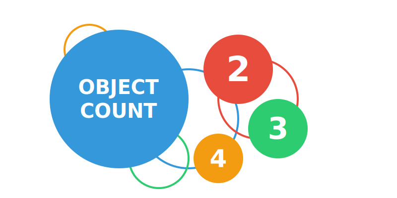

# Object Count - Bug Reports and Feature Requests 

<!--  -->

Welcome to the Object Count repository. This repository is dedicated to tracking bug reports, feature requests, and improvements for the Object Count web application. This space serves as the primary hub for submitting and discussing issues that can enhance our application.

## Table of Contents
- [Overview](#overview)
- [How to Report a Bug](#how-to-report-a-bug)
- [How to Request a Feature](#how-to-request-a-feature)
- [Issue Guidelines](#issue-guidelines)

## Overview

The Object Count application empowers users to efficiently and accurately count objects in images by harnessing advanced deep learning techniques, such as class-agnostic counting and image segmentation. With the ability to work from just a few reference examples, it delivers rapid and reliable results across a wide range of use cases, including traffic analysis, retail inventory tracking, and industrial process monitoring. This repository serves as the issue tracker where users can:

- Report bugs and unexpected behavior
- Suggest new features
- Propose enhancements to the user interface, performance, or functionality

Please make sure to follow the provided templates and guidelines to help maintainers address the issues or requests efficiently.

## About Object Count - Count Anything

## How to Report a Bug

If you encounter any bugs or issues with the Object Count web application, please first search the [existing issues](https://github.com/aiml-au/objectcount/issues) to see if the problem has already been reported. If not, [click here](https://github.com/aiml-au/objectcount/issues/new?assignees=&labels=&projects=&template=bug_report.md&title=) or follow the steps below to submit a new bug report:

1. Navigate to the **Issues** tab.
2. Click on the **New Issue** button.
3. Choose the **Get Started** next to **Bug Report** option.
4. Provide detailed information in the template:
   - **Description**: A concise description of the issue.
   - **Steps to Reproduce**: Clear and detailed steps that can help replicate the issue.
   - **Expected Behavior**: What you expected to happen.
   - **Actual Behavior**: What actually happened.
   - **Screenshots/Logs**: Include any relevant screenshots or error logs.
   - **Environment**: Information about your browser, device, or any other relevant setup details.
5. Submit the issue, and our team will review and investigate as soon as possible.

### Example Bug Report
      **Describe the bug**
      A clear and concise description of what the bug is.
      
      **To Reproduce**
      Steps to reproduce the behavior:
      1. Go to '...'
      2. Click on '....'
      3. Scroll down to '....'
      4. See error
      
      **Expected behavior**
      A clear and concise description of what you expected to happen.
      
      **Screenshots**
      If applicable, add screenshots to help explain your problem.
      
      **Desktop (please complete the following information):**
       - OS: [e.g. iOS]
       - Browser [e.g. chrome, safari]
       - Version [e.g. 22]
      
      **Smartphone (please complete the following information):**
       - Device: [e.g. iPhone6]
       - OS: [e.g. iOS8.1]
       - Browser [e.g. stock browser, safari]
       - Version [e.g. 22]
      
      **Additional context**
      Add any other context about the problem here.

## How to Request a Feature

Do you have an idea that could improve the Object Count web application? [Click here](https://github.com/aiml-au/objectcount/issues/new?assignees=&labels=&projects=&template=feature_request.md&title=) or follow the steps to submit a feature request:

1. Navigate to the **Issues** tab.
2. Click on the **New Issue** button.
3. Choose the **Get Started** next to **Feature Request** option.
4. Provide details in the template:
   - **Description**: A summary of the requested feature.
   - **Use Case**: How the feature will benefit users.
   - **Proposed Solution**: Any ideas on how the feature can be implemented.
   - **Alternatives**: Any alternatives you’ve considered.

### Example Feature Request
      **Is your feature request related to a problem? Please describe.**
      Explain the problem you're facing or what you want to solve. 
      What will this feature help with?
      
      **Describe the solution you'd like**
      A clear and concise description of what you want to happen.
      
      **Describe alternatives you've considered**
      A clear and concise description of any alternative solutions or features you've considered.
      
      **Additional context**
      Add any other context or screenshots about the feature request here.

## Issue Guidelines

To ensure smooth and effective issue management:

- **Be clear and concise**: Provide as much detail as possible to help us understand the issue or request.
- **One issue per report**: Do not combine multiple bugs or feature requests into a single issue. This helps in organising and addressing each one separately.
- **Search before posting**: Check if your bug or feature request has already been submitted by someone else to avoid duplication.

---

Thank you for your interest in helping us improve the Object Count application. We highly value your feedback and suggestions to enhance the application's performance and features!
